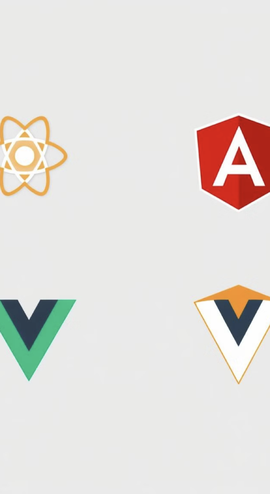
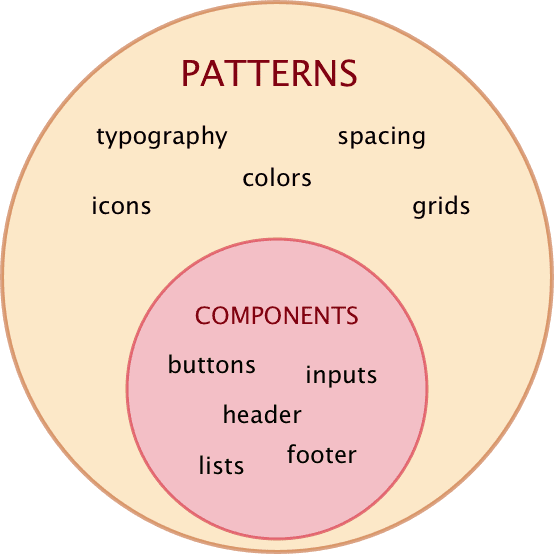
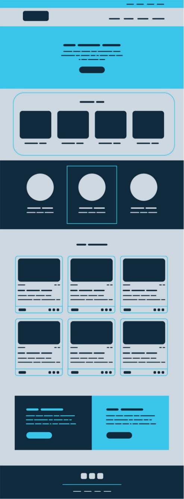
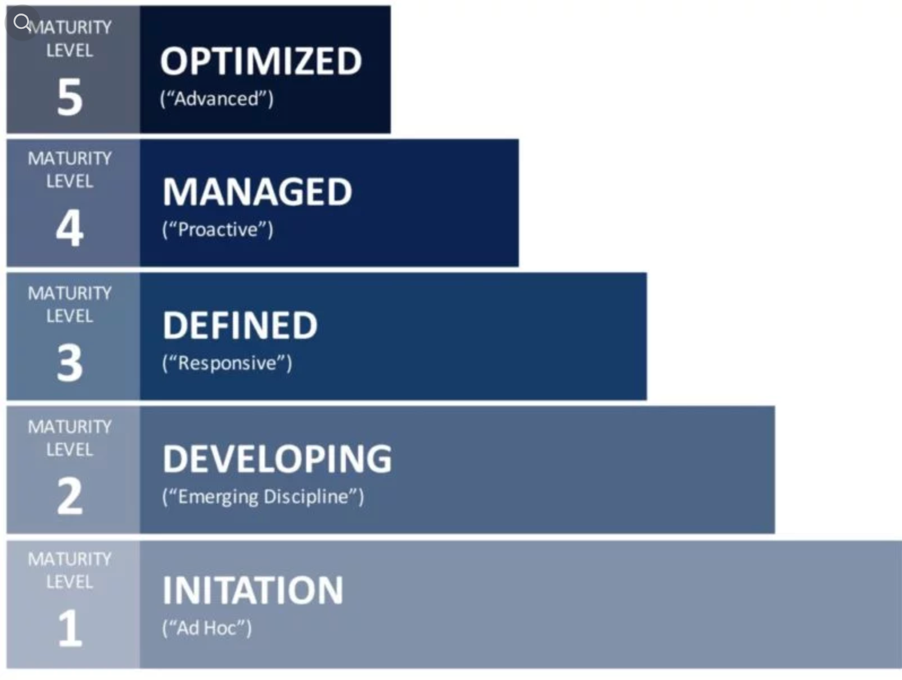
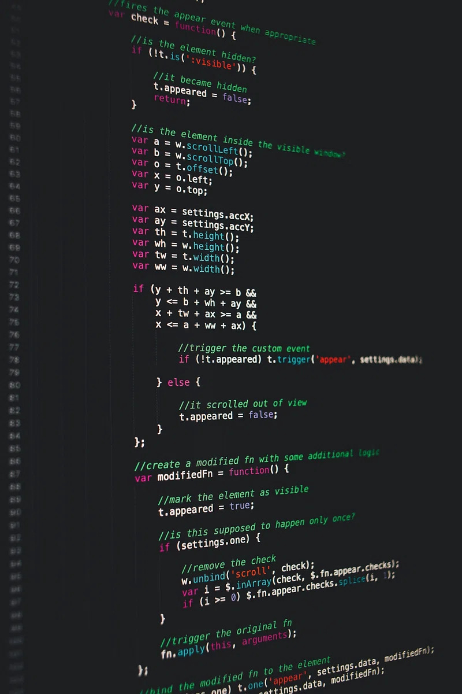

## Designing and developing<br /> User Interfaces
{#cover}

<Cover src="pictures/cover.jpg" alt=""/>

<div className="gap"></div>

[Varya Stepanova](https://varya.me) @ Aalto University, 2025

<style>{`
  #cover {
    padding-left: 60px;
    background-color: black;
    color: white;
  }
  #cover::after {
    display: none;
  } 
  #cover h2 {
    color: white;
    margin: 60px 0 30px;
    font-size: 60px;
    font-family: FF Meta Serif, sans-serif;
    line-height: 1.25em;
    margin-top: 225px;
    margin-bottom: 0;
    background-color: black;
    padding: 10px;
  }

  #cover h3 {
    width: 50%;
  }

  #cover p {
    margin: 10px 0 0;
    font-style: italic;
    font-size: 20px;
    width: 50%;
    line-height: 1.5em;
    background-color: black;
    padding: 10px;
  }
  #cover .gap {
    height: 10px;
  }
`}</style>

<!--
Welcome, everyone! Today we're going to talk about designing and developing user interfaces in 2025. This lecture will help you understand the challenges of building large-scale projects and introduce you to the concept of design systems.
-->


## Me
{ .no-title .about-me }


### Varya Stepanova
<b>Design Systems Architect</b><br/>
<small>engineering manager, frontend architect, independent consultant</small>

#### Contacts
<div className="contacts">
  <span className="bridge"></span><a href="https://bridge-the-gap.dev/">Bridge-the-Gap.dev</a>
  <br/>
  <span className="linkedin"></span><a href="https://www.linkedin.com/in/varyastepanova/">linkedin.com/in/varyastepanova</a>
  <br/>
  <span className="globe"></span><a href="http://varya.me">varya.me</a>
</div>


<style>{`
.about-me p {
  font-size: 80%;
}
.about-me .photo {
  float: left;
  width: 300px;
  margin-top: 1em;
  margin-bottom: 6em;
  margin-right: 1em;
  border-radius: 50%;
}

.about-me h4 {
  color: #ca4e1f;
  font: 1em/1 'FF Meta Serif',sans-serif;
  margin-bottom: .5em;
}
.about-me b {
  font-size: 1.25em;
}

.about-me .contacts {
  line-height: 1.5em;
  font-size: 0.8em;
}

.about-me .bridge
{
  content: "";
  display: inline-block;
  width: 1.5em;
  height: 1.5em;
  background-image:url(pictures/bridge-logo.png);
  background-size: cover;
  background-repeat: no-repeat;
  background-position: center;
  margin-right: 0.5em;
  margin-bottom: -0.25em;
}
.about-me .linkedin
{
  content: "";
  display: inline-block;
  width: 1.5em;
  height: 1.5em;
  background-image:url(pictures/linkedin-logo.png);
  background-size: cover;
  margin-right: 0.5em;
  margin-bottom: -0.25em;
}
.about-me .globe
{
  content: "";
  display: inline-block;
  width: 1.5em;
  height: 1.5em;
  background-image:url(pictures/globe.png);
  background-size: 1.15em;
  background-repeat: no-repeat;
  background-position: center;
  margin-right: 0.5em;
  margin-bottom: -0.5em;
}
`}</style>

<!--

My name is Varya. I work as an independent consultant on design systems with
major focus on frontend development. I started with libraries of components about 15 years ago,
before the term "design systems" even emerged.

By that time, my own understanding and the community's was more technical.
We were paying a lot of attention to how to code the components,
how to document them.

Slightly by today, I changed my focus to more process and people oriented.
I realised that the biggest obstacle on the way is the gap between specialists:
designers and developers, product people and business people. In the meanwhile
I got a design education that helped me to see the picture at scale.

Nowadays, even though I am still doing a lot of hands-on and architectural frontend
work related to the design systems, I shift to engineering & project management, educating,
and enganging people.

-->


## Lecture Content

1. Large-scale project challenges
1. Web: CSS and JavaScript
1. Component-driven development
1. Design Systems

<!--
Here's what we'll cover in today's lecture:
1. We'll start by looking at the challenges that come with large-scale projects.
2. Then, we'll discuss CSS and JavaScript, focusing on the tricky parts when working on big projects.
3. Next, we'll explore component-driven development, a modern approach to building interfaces.
4. Finally, we'll dive into design systems, which is the next step.

Let's get started!
-->

## Large-Scale Project Challenges
{ .block-list .title-08 }

- ### Complex Codebases<br/>
  Navigating intricate structures and dependencies in extensive projects.
- ### Large dynamic teams<br/>
  Coordinating work and maintaining consistency across diverse coding styles.
- ### Evolving Requirements<br/>
  Adapting to changing project needs while preserving code integrity.
- ### Maintenance Difficulties<br/>
  Keeping large codebases organized, efficient, and bug-free over time.

<!--
When working on big projects, developers face several challenges:
1. Complex codebases: As projects grow, the code becomes more complicated and harder to manage.
2. Large dynamic teams: With many people working together, it's tough to keep everyone on the same page.
3. Changing requirements: Projects often change direction, and the code needs to keep up.
4. Maintenance problems: Keeping a large project running smoothly over time is a big task.

These challenges are why we need better ways to design and develop user interfaces. Let's look at some specific issues with CSS and JavaScript.
-->


## Where is CSS hard?
{ .slide--shout .slide--highlighted }

<!--
Let's talk about CSS. Many developers think CSS is easy, but it can be tricky, especially in big projects. Let's look at some common CSS challenges.
-->


## Building meme
{ .no-title .slide--full-image }


<!--
This meme perfectly shows how CSS can be unpredictable. You might think you're building a simple structure, but one small change can make everything fall apart! This is why we need better ways to manage our CSS in large projects.
-->


## Anything wrong?

```css
H1 { color: blue }
P EM { font-weight: bold }
A:link IMG { border: 2px solid blue }
A:visited IMG { border: 2px solid red }
A:active IMG { border: 2px solid lime }
```

<!--
Now look at this code. Do you see something strange? Any guess?
Who would write their CSS like this?

Actually this code is still perfect. But it is from [CSS level 1 specification](http://www.w3.org/TR/CSS1/). It is
very simple, was recommended in 1996..

The problem is that CSS was created to make text bold and links underlined. It ideally suited
solving these problems. But time passed and we met new chalenges.

-->


## What makes CSS hard?

- Vertical centering
- Equal height columns
- Browser inconsistencies
- Unobvious tricks

<!--

When ppl are asked what is challenging with CSS, they usually answer
- vertical centing
- making columns of equial height
- browers render CSS differently, so it takes special knowledge and work to make the interface consistent
- many solutions are unobvious tricks which needed to be memorized

But these aren't the real challenges. You can easily find solutions for these online. Let's look at the actual difficult parts of CSS.

-->


## What <mark>really</mark> makes CSS hard?

* Scoping
* Specificity conflicts
* Non-deterministic matches
* Dependency management
* Removing unused code

<!--

The real hard problems of CSS are here:
- No scoping. Everything in CSS is global.
- Specificity conflicts. I'll explain in detal later.
- Non-deterministic matches which naturally result from declarativeness of CSS language
- Dependency management
- Removing unused code

-->


## CSS has no scoping

```css
a { /* Affects all the links */
  color: red;
}
ul li a { /* Affects all the links in lists */
  color: green;
}
```

<!--
One big problem with CSS is that it's global. This means that any CSS you write can affect your entire website. Look at this example:

The first rule affects all links on the site.
The second rule changes links in lists.

This global nature makes it hard to write CSS for specific parts of your site without accidentally changing other parts. It's especially tricky when you're working on a large-scale projects.
-->


## Specificity

> Specificity is the means by which a browser decides which property values are the most relevant to an element and gets
> to be applied. Specificity is only based on the matching rules which are composed of selectors of different sorts.

<!--
Specificity is another tricky part of CSS. It's how browsers decide which CSS rules to apply when there are conflicts. Understanding specificity is crucial for writing good CSS, especially in large projects. Let's look at how it works.
-->


## The most specific matters

```html
<div id="test">
  <span>Text</span>
</div>
```

```css
div#test span { color: green }
span { color: red }
div span { color: blue }
```

<!--
If a brower has 2, 3 or more rules which match the same DOM node, how it decides what are the properties to take into
work?
The order does not matter.
For every selector a browser calculates how important this set of rules is. The rule with the more specific selector
would be prioritized.
So, here we see...
-->


## How to overwrite?

```
<div class="sidebar">Left floated sidebar</div>
```

<div className="next">

```
.sidebar { /* Does it redefine `div.sidebar`?! */
  float: right;
}
```

</div>

<div className="next">

```
body .sidebar { /* Overwrites 'div.sidebar {}' */
  float: right;
}
```

</div>

<!--
When you're working on a big project, you often need to change existing styles. But because of specificity, this can be tricky. 

In this example, just writing `.sidebar` might not be enough to change the existing style. You might need to use a more specific selector like `body .sidebar` to make sure your new style is applied.

This is why CSS can get messy in big projects - you end up with very specific selectors just to overwrite other styles.
-->


## Specificity hell
{: .no-title }

```css
.navbar-inverse .navbar-nav>li>a {
  color: #999;
}

#home-menu-container #home-menu li a {
  color: red;
}

body #home-menu ul li a {
  color: blue !important;
}
```
{: .code--size--m }

<!--
This is what we call "specificity hell." It's when you have to write complex selectors just to apply simple styles. 

Look at these examples - they're all trying to change the color of a link. This kind of CSS is hard to maintain and understand. It's a common problem when working with large CSS frameworks or in big teams.
-->


## Family guy meme
{ .no-title .slide--full-image }


<!--
This meme perfectly captures how frustrating CSS specificity can be! Sometimes, no matter what you do, your styles just won't apply. It feels like you're fighting against the CSS itself. 
-->


## Non-deterministic matches

```css
#content div div {
  float: left;
}
```

<!--
Here's another tricky part of CSS. This selector, `#content div div`, might seem straightforward, but it can match many different elements in your HTML. 

When writing CSS, you provide criterias for the nodes which this CSS should be applied to. If we make an analogy with writing and address on an envelop, deterministic approach would be to write as we usually do: Konemiehentie 2, Espoo, Finland. While with non-deterministic approach — as we do in CSS — we write "a house on a small street with a green tree near it and a sea in 2 blocks".

As your project grows and changes, you can't always predict which elements this CSS will affect. This makes it hard to maintain and update your styles without breaking things unexpectedly.
-->


## Doctor meme
{ .no-title .slide--full-image }


<!--
This meme shows how CSS can sometimes feel like a guessing game. You might think you know what your CSS will do, but then it surprises you!
-->


## Dependency management
{ .dependency-management }

### No dependencies, sorry

<div className="next">

<h3>But what about?</h3>

```
@import url('i-need-this.css');
```

</div>

### No, sorry again.
{ .next .sorry }

<style>{`
.dependency-management h3 {
  padding-top: 1em;
  margin-bottom: 0.5em;
}
.dependency-management .sorry
{
  color: green;
}
`}</style>

<!--
In many programming languages, you can clearly state when one part of your code needs another part. But CSS doesn't have a good way to do this.

The `@import` rule exists, but it's not a great solution for big projects. It can slow down your website and doesn't solve the problem of knowing which styles depend on others.

This lack of proper dependency management makes it hard to organize and maintain CSS in large projects.
-->


## Removing unused code

100 pages in projects

```css
.person div a {
  color: pink;
}
```

Can I remove it? Will it break something? Maybe it is for a third-party HTML code?

<!--
Imagine you have a big website with 100 pages and you see this CSS rule. Can you safely remove it? It's hard to know!

Maybe it's used on a page you forgot about. Maybe it's for some third-party code. In a big project, you can't just remove CSS and visually check every page to see if something broke.

This is why unused CSS often sticks around, making stylesheets bigger and harder to manage over time.
-->


## Where CSS is hard?
{: .no-title .hard-css }

<table><thead>

<th markdown="1">

This is not hard in CSS

</th>

<th markdown="1">

This is!

</th>

</thead><tr>

<td className="left">

```
#sidebar ul li a {
  color: red;
  display: block;
  padding: 1em;
}
```

</td>

<td className="right">

```
#sidebar ul li a {
  color: red;
  display: block;
  padding: 1em;
}
```

</td>

</tr></table>

<style>{`

.hard-css .left {
  width: 50%;
  position: relative;
  line-height: 2em; /* Adjust this according to your design */
  background: linear-gradient(
    transparent 2em,
    #90EE90 2em,      /* Start from the 2nd line */
    #90EE90 8em,        /* End after the 4th line */
    transparent 8em    /* No highlight beyond the 4th line */
  );
  background-clip: padding-box; /* Ensure background is clipped to the content box */
}

.hard-css .right {
  width: 50%;
  position: relative;
  line-height: 2em; /* Adjust this according to your design */
  background: linear-gradient(
    #FF5733 0,
    #FF5733 2em,
    transparent 2em
  );
  background-clip: padding-box; /* Ensure background is clipped to the content box */
}

`}</style>

<!--
Let's sum up what we've learned about CSS challenges:

On the left, we see the CSS properties. These aren't the hard part of CSS. You can easily learn how to make text bold or change colors.

On the right, we see the selector. This is where CSS gets tricky. Deciding how to structure your selectors and ensuring your styles apply where you want (and only where you want) - these are the real challenges in CSS.

-->


## Where is JavaScript hard?
{ .slide--shout .slide--highlighted }

<!--
Now that we've looked at CSS challenges, let's turn to JavaScript. JavaScript has its own set of difficulties in large projects. Let's explore what makes JavaScript hard to manage as your project grows.
-->


## Old-School JavaScript Challenges
{ .numbered-list .title-08 }

- ### Direct DOM Manipulation
  Messy code with direct element selection and modification.
- ### Event Handling Complexity
  Difficult management of multiple event listeners and callbacks.
- ### State Management
  Lack of centralized state leading to inconsistent UI updates.
- ### Maintenance Problems
  Spaghetti code without clear structure, making updates risky.

<!--
Traditional JavaScript development often faces these problems:

1. Direct DOM Manipulation: Changing HTML directly with JavaScript can get messy fast.
2. Complex Event Handling: Managing many event listeners can be confusing.
3. State Management: Keeping track of data and UI state gets complicated without a system.
4. Maintenance Issues: Old JavaScript code can turn into "spaghetti code" that's hard to update.

These issues make it difficult to build and maintain large JavaScript applications. Let's look at a better approach.
-->


## Maintenance Mayhem
{ .block-list }

- ### Code Comprehension
  Difficulty understanding complex, intertwined code over time.
- ### Risky Updates
  Fear of breaking unknown dependenciesч when making changes.
- ### Inconsistent Components
  Similar components diverge, leading to maintenance nightmares.
- ### Scalability Issues
  Growing projects become increasingly difficult to manage and expand.

<!--
Maintaining large JavaScript projects can be a real headache:

1. It's hard to understand complex code, especially if you didn't write it.
2. Making changes is scary because you might break something unexpectedly.
3. Similar components start to differ over time, creating inconsistencies.
4. As the project grows, it becomes harder and harder to add new features.

-->


## Component-Driven Development
{ .slide--shout .slide--primary }

<!--
Now, let's talk about a better way to build user interfaces: component-driven development. This approach helps solve many of the problems we've discussed with CSS and JavaScript.
-->


## Component-Driven Development
{ .numbered-list .title-08 }

- ### UI Breakdown
  Dividing interfaces into reusable, independent components.
- ### Encapsulation
  Bundling functionality and styling within self- contained units.
- ### Consistency
  Promoting uniform design and behavior across the application.
- ### Maintainability
  Easier updates and bug fixes with isolated component logic

<!--
Component-driven development is a way of building user interfaces by breaking them into reusable parts. Here's how it works:

1. We divide the interface into independent, reusable components.
2. Each component contains its own HTML, CSS, and JavaScript.
3. This approach helps keep designs consistent across the application.
4. It's easier to update and fix bugs because each component is self-contained.

-->

## Benefits of Component-Driven Development
{ .title-06 .cover--top .table--naked .text-08 }

<Cover src="pictures/v1-13.jpg" alt=""/>

| Reusability | Easier Testing | Improved Collaboration | Faster Development |
|----------|----------|----------|----------|
| Components can be easily reused across different parts of the application. | Isolated components allow for more straightforward and thorough testing. | Designers and developers can work more efficiently on specific components. | Reusable components speed up the development and iteration process. |

<!--
Component-driven development offers several key benefits:

1. Reusability: You can use components in different parts of your app, saving time.
2. Easier Testing: You can test each component separately, which is simpler than testing a whole page.
3. Better Teamwork: Designers and developers can work on specific components, making collaboration easier.
4. Faster Development: With reusable components, you can build and update your app more quickly.

These benefits make component-driven development a powerful approach for large projects.
-->


## Component-Driven Development in JavaScript Frameworks
{ .no-title }

{: .cover--right .cover }

### React
Virtual DOM, JSX syntax

### Angular
Directives, two-way data binding

### Vue
Reactivity system, template-based components

### Web Components (Lit, Stencil)
Framework-agnostic

<!--
Many popular JavaScript frameworks support component-driven development:

1. React uses a virtual DOM and JSX syntax for creating components.
2. Angular has a system of directives and two-way data binding.
3. Vue offers a reactivity system and template-based components.
4. Web Components, used with tools like Lit or Stencil, work across different frameworks.

Each of these frameworks has its own way of implementing components, but they all aim to make UI development more organized and efficient.
-->


## CSS Modules
{ .block-list .text-08 }

- **Scoped Styles by Default**: CSS Modules provide scoped styles by default, preventing global conflicts.
- **Automatic Unique Class Names**: Class names are automatically transformed into unique identifiers, ensuring local scope.
- **Easy Style Composition**: Allows for composition of styles across multiple CSS Modules, enabling reusable and modular design.
- **CSS Isolation**: Avoids styling collisions by scoping styles to individual components, promoting maintainable and scalable code.

<!--
CSS Modules is a technique that helps solve many of the CSS problems we discussed earlier:

1. It automatically creates unique class names, avoiding global conflicts.
2. Styles are scoped to specific components by default.
3. You can easily combine styles from different modules.
4. It prevents styling collisions between components.

CSS Modules make it easier to write maintainable CSS in large projects by keeping styles isolated to their components.
-->


## CSS-in-JS: Dynamic Styling
{ .numbered-list .title-08 }

- ### ~~Styled-components~~
  ~~Allows you to write CSS directly within JavaScript.~~
- ### Emotion
  Supports for both string and object styles.
- ### JSS
  CSS as JavaScript objects, commonly used with React.
- ### ~~Stitches~~
  ~~Near-zero runtime, lightweight, focus on architecture.~~

<!--
CSS-in-JS is another approach to styling components. Here are some popular tools:

1. Styled-components: Let you write CSS directly in your JavaScript. Now in maintenance mode. No new features but bugs are fixed.
2. Emotion: Supports both string and object styles.
3. JSS: Defines CSS as JavaScript objects, often used with React.
4. Stitches: Focuses on performance and architecture.

These tools bring CSS closer to your component logic, making it easier to create dynamic, scoped styles.
-->


## Utility-first CSS
{ .numbered-list .title-08 }

- ### Tailwind
  Predefined CSS classes and themable configuration
- ### UnoCSS
  Instant on-demand atomic CSS engine: [unocss.dev](https://unocss.dev/)

  ```
  <Button border-radius="md" border-color="info-dark" />
  ```


## From technology to a system
{ .slide--shout }

<!--
Now that we understand component-driven development, let's take it a step further. We're going to look at how to create a complete system for designing and developing user interfaces.
-->


## Best Practices for Modular Design
{ .title-08 }

- **Single Responsibility Principle**: Each component should have one clear purpose or functionality.
- **Composability**: Design components that can be easily combined to create complex UIs.
- **Naming Conventions**: Maintain consistent and descriptive naming for components and props.

<!--
When designing components, keep these best practices in mind:

1. Single Responsibility: Each component should do one thing well.
2. Composability: Design components that work well together to build complex UIs.
3. Consistent Naming: Use clear, descriptive names for components and their properties.

Following these practices will help you create a more organized, maintainable component system.
-->


## Design and UI require a systematic approach​
{ .systematic-approach }

<Cover src="pictures/car-parts.jpg" alt=""/>

<style>{`
  .systematic-approach h2 {
    bottom: 25px;
    position: absolute;
    background-color: #b7c9e2;
    margin-right: 100px;
    padding: 10px;
  }
`}</style>

<!--
Think of a car. It's not just a collection of random parts - it's a carefully designed system where each part works together. 

User interfaces are similar. We need a systematic approach to ensure all parts of our interface work well together. This is where design systems come in.
-->


## Introduction to Design Systems
{ .slide--shout .slide--primary }

<!--
Now, let's dive into design systems. A design system is a complete set of standards for designing and developing user interfaces. It's like a recipe book for creating consistent, efficient UIs.
-->


## Diagram 1
{ .no-title .vocabulary-diagram }

{: .cover }

"Design Systems Vocabulary — A Review of Key Terms and Concepts", https://varya.me/blog/design-systems-review/

<style>{`

.vocabulary-diagram .cover {
  width: auto;
  height: 80%;
  padding-bottom: 1.5em;
}

.vocabulary-diagram p {
  position: absolute;
  bottom: 1em;
  font-size: 0.6em;
}

`}</style>

## Diagram 2
{ .no-title .vocabulary-diagram }

<Cover src="pictures/diagram-2.png" alt=""/>

"Design Systems Vocabulary — A Review of Key Terms and Concepts", https://varya.me/blog/design-systems-review/

## Diagram 3
{ .no-title .vocabulary-diagram }

<Cover src="pictures/diagram-3.png" alt=""/>

"Design Systems Vocabulary — A Review of Key Terms and Concepts", https://varya.me/blog/design-systems-review/

## Diagram 4
{ .no-title .vocabulary-diagram }

<Cover src="pictures/diagram-4.png" alt=""/>

"Design Systems Vocabulary — A Review of Key Terms and Concepts", https://varya.me/blog/design-systems-review/

<!--
-->


## Definition
{ .no-title .slide--shout .definition }

Design systems are the foundation of consistent user interfaces. They provide reusable components, patterns, and guidelines for creating cohesive products across platforms.

<div class="arrow-down"></div>

<Blockquote>
"Design systems" is a systematic approach for creating, implementing, and maintaining user interfaces.
</Blockquote>

<style>{`

.definition .arrow-down {
  width: 0;
  height: 0;
  border-left: 30px solid transparent;
  border-right: 30px solid transparent;
  border-top: 60px solid #ca4e1f; /* Arrow triangle color */
  position: relative;
  margin: 50px auto;
}

.definition .arrow-down::before {
  content: '';
  position: absolute;
  top: -60px;
  left: -5px;
  width: 10px;
  height: 60px;
  background-color: #75d3d1; /* Tail color */
  z-index: -1;
}

.definition .arrow-down::after {
  content: '';
  position: absolute;
  top: -5px;
  left: -35px;
  width: 70px;
  height: 70px;
  background-color: rgba(0, 0, 0, 0.2); /* Black shadow */
  border-radius: 50%;
  z-index: -2;
}

`}</style>

<!--
Here's a key definition to remember:

"Design systems" is a systematic approach for creating, implementing, and maintaining user interfaces.

This means it's not just a set of components or guidelines. It's a complete way of thinking about and managing UI design and development. It helps teams create consistent, efficient, and user-friendly interfaces across large projects or multiple products.
-->


## Key Components of a Design System
{ .key-components .title-08 }

- ### Design Tokens
  Fundamental design elements like colors, typography, and spacing.
- ### UI Components
  Reusable interface elements such as buttons, forms, and cards.
- ### Patterns
  Recurring solutions for layout structures and interaction patterns.
- ### Guidelines
  Usage rules, accessibility standards, and best practices.

<style>{`

.slide.key-components ul {
    list-style-type: none;
    padding: 0;
    font-size: 0.8em;
}

.slide.slide.key-components ul li {
    padding-left: 2.25em;
}

.slide.slide.key-components ul > li:before {
  content: '';
  display: inline-block;
  width: 24px;
  height: 24px;
  margin-right: 10px;
  background-size: contain;
  background-repeat: no-repeat;
  left: -1.25em;
}

.slide.key-components ul li:nth-child(1)::before {
  background-image: url(icons/design-tokens-icon.svg);
  color: transparent;
}
.slide.key-components ul li:nth-child(2)::before {
  background-image: url(icons/ui-components-icon.svg);
  color: transparent;
}
.slide.key-components ul li:nth-child(3)::before {
  background-image: url(icons/patterns-icon.svg);
  color: transparent;
}
.slide.key-components ul li:nth-child(4)::before {
  background-image: url(icons/guidelines-icon.svg);
  color: transparent;
}
`}</style>

<!--
Let's break down the main parts of a design system:

1. Design Tokens: These are the basic elements like colors, fonts, and spacing. They're the building blocks of your design.
2. UI Components: These are reusable interface elements like buttons, forms, and cards. They're built using design tokens.
3. Patterns: These are common solutions for layouts and interactions. They show how to use components together.
4. Guidelines: These are the rules for using everything in the system. They ensure consistency and good practices.

Together, these components create a complete toolkit for designing and building user interfaces.
-->


## Design Systems — Why?
{ .numbered-list .list-table .title-08 }


<table>
<tr>
<td>

- ### Consistency Across Products
  Design systems ensure a unified look and feel across all digital products, reinforcing brand identity and improving user recognition.
- ### Enhanced Collaboration
  A shared language and resource base foster better communication between designers, developers, and other stakeholders.

</td>

<td className="right">

- ### Accelerated Development
  By providing pre-built components and clear guidelines, design systems significantly reduce development time and effort.
- ### Simplified Onboarding
  New team members can quickly understand and contribute to projects by referencing the comprehensive design system documentation.

</td>
</tr>
</table>

<style>{`

.slide.list-table .right ul {
  counter-reset: li 2;
}

`}</style>

<!--
-->

## Do those buttons function the same way?​
{ .no-title .button }

### Do those buttons function the same way?​
{ .next .question }

<Cover src="pictures/buttons.png" alt=""/>

##### Credits: Andrey Okonetchnikov, https://www.youtube.com/watch?v=sV4chQq-H7o 
{ .credits }

<style>{`
.button .cover {
  margin-top: -50px;
}
.button .question {
  background-color: white;
  font-size: 60px;
  padding: 10px;
  margin-top: 60px;
}
.button .credits {
  font-size: 60%;
  position: absolute;
  bottom: 25px;
}
`}</style>

<!--
Look at these buttons. They look similar, but do they work the same way? This is a common problem in large projects without a design system.

Without a system, different teams might create buttons that look alike but behave differently. This can confuse users and make the interface inconsistent.

A design system helps solve this by providing a standard set of components that look and function consistently across the entire product or multiple products.
-->


## Design Tokens: The Building Blocks
{ .slide--3-columns .title-08 .text-08 }

### Colors

A color palette that includes primary, secondary, and accent colors, along with their various shades and tints. These colors are used consistently across all UI elements to maintain visual harmony.

### Typography

A set of font families, sizes, weights, and line heights that define the textual hierarchy and readability of the interface. This includes headings, body text, captions, and other typographic elements.

### Spacing 

Standardized units of measurement for margins, padding, and layout grids. Consistent spacing ensures proper alignment and visual rhythm throughout the interface.

<!--
Design tokens are the smallest elements of a design system. They include:

1. Colors: A set palette for the entire system, including main colors and variations.
2. Typography: Font families, sizes, and styles for different text elements.
3. Spacing: Standard measurements for margins, padding, and layout grids.

These tokens ensure consistency across all parts of your interface. By using tokens, you can easily update the entire look of your product by changing just a few basic values.
-->


## UI Components: The Building Blocks of UI
{ .ui-components .title-06 }

- ### Buttons
  Interactive elements that trigger actions or navigate users to different parts of the application.
- ### Forms
  Input fields, checkboxes, and other elements that allow users to enter and submit data.
- ### Cards
  Containers for presenting related information in a compact and visually appealing format.
- ### Navigation
  Menus, breadcrumbs, and other elements that help users move through the application.

<style>{`
.slide.ui-components ul {
    list-style-type: none;
    padding: 0;
    font-size: 0.8em;
}

.slide.ui-components ul li {
    padding-left: 2.25em;
    margin-bottom: 0.5em;
}

.slide.ui-components p {
  margin-bottom: 0;
}

.slide.slide.ui-components ul li:before {
  content: '';
  display: inline-block;
  width: 24px;
  height: 24px;
  margin-right: 10px;
  background-size: contain;
  background-repeat: no-repeat;
  position: absolute;
  left: 0;
  top: 0.25em;
}

.slide.ui-components ul li:nth-child(1)::before {
  color: transparent;
  background-image: url(icons/buttons-icon.svg);
}
.slide.ui-components ul li:nth-child(2)::before {
  color: transparent;
  background-image: url(icons/forms-icon.svg);
}
.slide.ui-components ul li:nth-child(3)::before {
  color: transparent;
  background-image: url(icons/cards-icon.svg);
}
.slide.ui-components ul li:nth-child(4)::before {
  color: transparent;
  background-image: url(icons/navigation-icon.svg);
}

.slide.ui-components h3 {
  margin-bottom: 0.25em;
}

.slide.ui-components p {
  margin-top: 0;
}
`}</style>

<!--
UI components are the reusable parts of your interface. They include:

1. Buttons: For user actions and navigation.
2. Forms: For data input and submission.
3. Cards: For displaying related information in a compact way.
4. Navigation: Menus and other elements for moving around the app.

These components are built using design tokens, ensuring they all fit together visually. They save time and maintain consistency across your product.
-->


## Patterns: Solving Common UI Challenges
{ .numbered-list .title-06 .text-06 .patterns }

{: .cover--right .cover }

- ### Layout Structures
   Standardized arrangements of UI elements, such as grid systems and responsive layouts, that ensure consistency across different screen sizes and devices.

- ### Interaction Patterns
   Common user behaviors and expectations, like hover effects, drag-and-drop functionality, and scrolling behaviors, that are implemented consistently throughout the interface.

- ### Data Visualization
   Guidelines for presenting complex information in easily digestible formats, including charts, graphs, and infographics.

- ### Error Handling
   Consistent approaches to displaying and resolving errors, including form validation, error messages, and recovery options.

<style>{`

.patterns {
padding-right: 20em;
}

`}</style>

<!--
Patterns are larger structures made from components. They include:

1. Layout Structures: How to arrange elements on different screen sizes.
2. Interaction Patterns: Common behaviors like hover effects or scrolling.
3. Data Visualization: Guidelines for presenting complex information.
4. Error Handling: How to show and resolve errors consistently.

Patterns help solve common design problems in a standard way across your product.
-->


## Guidelines: Ensuring Proper Implementation
{ .numbered-list .title-06 .text-06 .guidelines }

{: .cover--right .cover }

- ### Usage Rules
   Clear instructions on when and how to use specific components and patterns, including do's and don'ts to maintain consistency and effectiveness.

- ### Accessibility Standards
   Detailed requirements for ensuring that all UI elements are accessible to users with disabilities, including color contrast ratios, keyboard navigation, and screen reader compatibility.

- ### Responsive Design Guidelines
   Principles for adapting layouts and components to different screen sizes and devices, ensuring a consistent experience across platforms.

- ### Brand Voice and Tone
   Guidelines for maintaining a consistent brand personality in all textual elements, including microcopy, headings, and error messages.

<style>{`

.guidelines {
padding-right: 20em;
}

`}</style>

<!--
Guidelines are the rules for using your design system. They cover:

1. Usage Rules: When and how to use specific components and patterns.
2. Accessibility Standards: Ensuring your interface works for all users.
3. Responsive Design Guidelines: How to adapt your design to different devices.
4. Brand Voice and Tone: How to maintain a consistent brand personality in text.

These guidelines help everyone use the design system correctly and consistently.
-->


## Examples
{ .slide__examples }

- Fluent (by Microsoft) https://www.microsoft.com/design/fluent​
- Atlassian Design System https://atlassian.design/ ​
- Carbon (by IBM) https://www.carbondesignsystem.com/ ​
- Airbus Design System https://maevahemon.fr/airbus.html ​
- Material UI by Google https://material.io/​
- Polaris (by Shopify) https://polaris.shopify.com/ ​
- US government Design System https://designsystem.digital.gov/ ​
- Audi Design System https://www.audi.com/ci/en/guides/user-interface/introduction.html​
- UK government Design System https://design-system.service.gov.uk/ 

<style>{`
  .slide__examples {
    font-size: 80%;
  }
`}</style>

<!--
Here are some real-world examples of design systems:

- Fluent by Microsoft
- Atlassian Design System
- Carbon by IBM
- Material UI by Google
- And many others

Each of these systems shows how large companies use design systems to maintain consistency across their products. Take some time to explore these examples - they're great resources for learning about design systems in practice.
-->


## Design System Catalogs
{ .slide--3-columns .catalogs }

### [Design Systems Surf](https://designsystems.surf/)

### [Component Gallery](https://component.gallery/)

### ["Complete" Design System](https://miro.com/app/board/uXjVPXCoofw=/)

<style>{`

.catalogs.slide {

  padding-top: 9em;
}

.catalogs.slide a {
  text-decoration: none;
  background: none;
}

`}</style>

<!--
These catalogs are great resources for exploring design systems.
-->

## Design Systems Advantages
{ .slide--shout .slide--highlighted }

<!--
Now that we've explored what design systems are, let's talk about why they're so valuable. Design systems offer several key advantages in user interface development.
-->


## Design-and-Development Disconnect

- Different tools and Workflows
- Mental Models
- Communication Challenges
- Unoptimal Organisation Structure

<!--
Before we dive into the advantages, let's look at a common problem design systems help solve:

1. Different Tools: Designers and developers often use different software.
2. Mental Models: They might think about the interface in different ways.
3. Communication Issues: This can lead to misunderstandings between teams.
4. Inefficient Structure: Traditional team setups can slow down work.

These disconnects can cause delays, inconsistencies, and frustration in projects. Design systems help bridge these gaps.
-->


## [Aligning UX designers and UI developers work with design systems](https://varya.me/design-systems/aligning-ux-designers-and-ui-developers/)
{ .slide--shout .thesis }

Master thesis in International Design Business Management (IDBM)<br/> by Varya Stepanova, Aalto University, 2021

<style>{`

.thesis.slide {
  padding-bottom: 2em;
}

.thesis.slide h2 {
  line-height: 1.25em;
}
.thesis.slide p {
  line-height: 1.25em;
}

.thesis.slide a {
  text-decoration: none;
  background: none;
}

`}</style>

<!--
This slide refers to a master's thesis I wrote on this topic. The key idea is that design systems can help align the work of UX designers and UI developers. 

By providing a shared language and set of tools, design systems help these two groups work together more effectively. This leads to more consistent, efficient, and user-friendly interfaces.
-->


## What exactly changes?
{ .slide--shout }

<!--
Now, let's look at how design systems change the development process. We'll compare the old way of working to the new, design system approach.
-->


## The old school way​
{ .cover-w-80 .black }

<Cover src="pictures/old-school.png" alt=""/>

<!--
This image shows the traditional way of designing and developing interfaces:

1. Designers create static mockups.
2. These are handed off to developers.
3. Developers try to recreate the design in code.

This process often leads to miscommunication and inconsistencies. The final product might not match the original design, and it's hard to maintain consistency across a large project.
-->


## Dashed process​
{ .cover-w-80 .black }

<Cover src="pictures/dashed-process.png" alt=""/>

<!--
This "dashed" process shows an improvement, but it's still not ideal:

1. There's more back-and-forth between designers and developers.
2. This can lead to better outcomes, but it's often slow and inefficient.
3. There's still no systematic approach to ensure consistency.

While better than the old school way, this process can still result in misalignments and inefficiencies.
-->


## Products are systems
{ .no-title .slide--shout }

<Blockquote caption="Anna Debenham​">
Products are systems rather than pages and as soon as we stop perceiving them as that, the better.
</Blockquote>

<!--
This quote from Anna Debenham is crucial: "Products are systems rather than pages."

This means we need to think about our products holistically, not as individual pages or features. This system thinking is at the heart of design systems. It helps us create more cohesive, consistent user experiences.
-->


## UI composition
{ .cover-w-80 }

<Cover src="pictures/bem-blocks.png" alt=""/>

<!--
This image shows how user interfaces are composed of smaller parts:

1. We have basic elements like buttons and inputs.
2. These combine into larger components like forms or cards.
3. These components then make up full pages or features.

This compositional approach is key to design systems. It allows us to build complex interfaces from simple, reusable parts.
-->


## Creating UI with a design system​
{ .cover-w-80 .black }

<Cover src="pictures/workflow-ds.png" alt=""/>

<!--
This diagram shows how design systems change the development process:

1. The design system provides a shared library of components and patterns.
2. Both designers and developers work from this shared system.
3. This leads to faster, more consistent development.
4. The final product is more cohesive and easier to maintain.

This approach solves many of the problems we saw in the earlier processes.
-->


## Tools for Design Systems
{ .numbered-list }

- ### Design and Handoff
- ### Documenting
- ### Tokens Streamline
- ### Development Playgrounds
- ### Testing

<!--
Design systems use various tools at different stages:

1. Design and Handoff: Tools for creating and sharing designs.
2. Documenting: Ways to explain how to use the system.
3. Tokens Streamline: Managing design tokens across the system.
4. Development Playgrounds: Places to experiment with components.
5. Testing: Ensuring components work correctly.

These tools help teams create, use, and maintain design systems effectively.
-->

## Tools examples
{ .no-title .numbered-list .text-08 }

- ### Design and Handoff
  Figma, Sketch, Zeplin
- ### Documenting
  Storybook, Zeroheight, Confluence, Notion
- ### Tokens Streamline
  Style Dictionary, Supernova
- ### Development Playgrounds
  Storybook, Bit.dev
- ### Testing
  Chromatic, Testplane, Jest

<!--
Here are some specific tools used in design systems:

1. Design and Handoff: Figma, Sketch, Zeplin
2. Documenting: Storybook, Zeroheight, Confluence, Notion
3. Tokens Streamline: Style Dictionary, Supernova
4. Development Playgrounds: Storybook, Bit.dev
5. Testing: Chromatic, Testplane, Jest

Each of these tools serves a specific purpose in the design system workflow. They help teams work more efficiently and maintain consistency.
-->

## Business value of<br/>design system
{ .business-value }

{: .cover .cover--right }

- Product recognizability​
- Faster design and development​
- Fewer costs​
- "Time to market" decreased​
- Doing "real work"

<style>{`

.business-value.slide .cover {
  left: 60%;
}

`}</style>

<!--
Design systems provide significant business benefits:

1. Product recognizability: Consistent interfaces are more memorable.
2. Faster design and development: Reusable components speed up work.
3. Lower costs: Less time spent on redundant work.
4. Faster time to market: Products can be built and updated more quickly.
5. Focus on "real work": Less time on basic UI, more on unique features.

These benefits make design systems valuable for businesses of all sizes.
-->


## Getting mature
{ .getting-mature }

<div class="arrow">⬅</div>

{ .image }

<style>{`

.getting-mature .image {
  height: 400px;
}

.getting-mature .arrow {
  font-size: 200px;
  color: #fff;
  font-family: "ubuntu";
  text-transform: uppercase;
  font-weight: 700;
  font-family: "Josefin Sans", sans-serif;
  background: linear-gradient(to right, #38bcc2 10%, #ca4e1f 50%, #e69445 60%);
  background-size: auto auto;
  background-clip: border-box;
  background-size: 200% auto;
  color: #fff;
  background-clip: text;
  text-fill-color: transparent;
  -webkit-background-clip: text;
  -webkit-text-fill-color: transparent;
  animation: textclip 1.5s linear infinite;
  display: inline-block;
  position: absolute;
  top: 50px;
  right: 250px;

}
@keyframes textclip {
	to {
		background-position: 200% center;
	}
}

`}</style>

<!--
This diagram shows the maturity levels of design systems:

1. As you move right, design systems become more sophisticated and valuable.
2. The arrow points left, suggesting we should start simple and gradually improve.
3. Even basic design systems can provide benefits.

The goal is to continually improve your design system, making it more comprehensive and effective over time.
-->


## Maturity
{ .no-title }

### The highest levels of maturity are achieved with design systems

The very fact of design systems emerging as a new approach and a set of artifacts that affect the process of development demonstrates the subject of Organizational Innovation and Deployment.

<!--
Design systems represent a high level of maturity in UI development:

1. They show organizational innovation in how interfaces are created.
2. They affect the entire process of development, not just individual tasks.
3. The most mature organizations use comprehensive design systems.

Implementing a design system is a sign of a mature, efficient development process.
-->


## Design Systems Advanced Challenges
{ .slide--shout .slide--primary }

<!--
While design systems offer many benefits, they also come with their own challenges. Let's look at some advanced issues teams face with design systems.
-->


## Advanced challenges
{ .block-list .advanced-challenges .title-08 }

{: .cover .cover--right }

- ### Maintaining and Scaling Design Systems
- ### API
- ### Balance between standartisation and customization
- ### Automations

<style>{`

.advanced-challenges.slide {
  padding-right: 18em;
}

`}</style>

<!--
Here are some key challenges in managing design systems:

1. Maintaining and Scaling: Keeping the system up-to-date as it grows.
2. API Design: Creating intuitive ways for developers to use components.
3. Balancing Standards and Customization: Making the system flexible yet consistent.
4. Automations: Using tools to streamline design system processes.

These challenges require ongoing attention and problem-solving as your design system evolves.
-->

<!--

Comment from Arnaud:
"In my experience, when you want to bridge the gap between design and engineering, the winning combo is to align the APIs and ensure that what designers have access to is also available in dev (and, of course, the other way around). 

The second topic is the balance between configuration and customization, the best way to illustrate that is this amazing article from Spotify engineering team: https://engineering.atspotify.com/2023/05/multiple-layers-of-abstraction-in-design-systems/"

-->

## Design systems and AI
{ .slide--shout .slide--highlighted }

## Design systems and AI
{ .slide--3-columns .title-08 .text-08 }

### Structured AI-Agent Friendly Architecture

Design systems are AI-friendly, thanks to their structured nature. An AI agent can introduce new tokens and
create new components and patterns "by analogy".

### Automations and Rapid Development

AI-powered automation make development cycles faster. From generating component variants to automated testing and documentation updates.

### Custom MCP (Model Context Protocol)

**AI agents** can interact with a design system through custom MCPs.
This ensures correct usage of design systems and coherent UX across brand portfolio.

## Custom MCP for Design Systems
{ .slide--shout .slide--primary }

## The Problem: Uncontrolled AI Generation
{ .numbered-list .title-08 .text-08 }

- ### AI Agents Are Everywhere
  Developers increasingly use AI to generate code quickly and easily.
- ### Custom Solutions Proliferate  
  Without guidance, AI creates ad-hoc solutions using Tailwind, custom CSS, etc.
- ### Brand Coherence Breaks Down
  Over time, inconsistent implementations fragment the user experience.
- ### Design System Adoption Drops
  Teams bypass established patterns in favor of AI-generated shortcuts.

<!--
The widespread adoption of AI coding assistants creates a new challenge for design systems. While AI makes development faster, it can also lead to inconsistent implementations that bypass established design patterns. Without proper guidance, AI agents tend to create custom solutions rather than using existing design system components.
-->

## The Solution: Taming AI with MCP Server
{ .mcp-solution .title-08 }


** Model Context Protocol (MCP) Server** is
a dedicated server that provides AI agents with structured access to your design system, ensuring consistent component usage and brand adherence.

<!--
The solution is to implement a Model Context Protocol (MCP) server specifically for your design system. This server acts as a bridge between AI agents and your design system, providing structured guidance on component usage, design tokens, and implementation patterns.
-->

## MCP Schema
{ .no-title .mcp-schema }

<Cover src="pictures/mcp-schema.png" alt=""/>

##### Credits: Pierre Bremell, https://medium.com/design-bootcamp/how-to-build-an-ai-design-system-6d80d7aa200d
{ .credits }

<style>{`
.mcp-schema .cover {
  margin-top: -50px;
}
.mcp-schema .credits {
  font-size: 60%;
  position: absolute;
  bottom: 25px;
}
`}</style>

## Infrastructure Requirements
{ .block-list .infrastructure .title-08 }

- ### Multi-Model Testing
  Test MCP compatibility across different AI models (Claude, GPT, Gemini).
- ### Component Registry
  Maintain up-to-date catalog of available components and their APIs.
- ### Usage Analytics
  Monitor which components are requested and how they're being used.
- ### Continuous Updates
  Keep MCP server synchronized with design system changes.

<style>{`
.infrastructure ul li {
  background-color: #f8f9fa;
  border-left: 4px solid #75d3d1;
  padding: 15px 15px 10px 20px;
  margin-bottom: 15px;
  border-radius: 0 8px 8px 0;
}

.infrastructure h3 {
  color: #ca4e1f;
  margin-bottom: 0.25em;
}
`}</style>

<!--
Implementing an MCP server for design systems requires significant infrastructure:

1. Multi-Model Testing: Different AI models may interpret MCP responses differently, requiring thorough testing.
2. Component Registry: A real-time catalog of all available components with their current APIs and usage guidelines.
3. Usage Analytics: Understanding how AI agents are using your design system helps improve the MCP server.
4. Continuous Updates: The MCP server must stay synchronized with design system evolution.

This infrastructure investment is crucial for maintaining brand coherence in an AI-driven development environment.
-->


## Future Trends in Design Systems
{ .slide--shout .slide--highlighted }

<!--
Let's look ahead to see where design systems are going in the future. These trends will shape how we create and use design systems in the coming years.
-->

## Future Trends in Design Systems
{ .numbered-list }

- ### More automations
- ### Dynamic theming
- ### Smarter testing
- ### Easier adoption in products

<!--
Here are some key trends to watch in design systems:

1. More automations: Tools will handle more routine tasks automatically.
2. Dynamic theming: Interfaces will adapt more easily to user preferences.
3. Smarter testing: We'll see better ways to ensure design and code stay in sync.
4. Easier adoption: It will become simpler to implement design systems in products.

These trends will make design systems more powerful and easier to use, further improving UI development processes.
-->


## Thank you
{ .thanks }


#### [Slides: varya.me/design-and-develop-ui-2025/](https://varya.me/design-and-develop-ui-2025/)

#### by Varya Stepanova

<div className="contacts">
  <span className="bridge"></span><a href="https://bridge-the-gap.dev/">Bridge-the-Gap.dev</a>
  <br/>
  <span className="linkedin"></span><a href="https://www.linkedin.com/in/varyastepanova/">linkedin.com/in/varyastepanova</a>
  <br/>
  <span className="globe"></span><a href="http://varya.me">varya.me</a>
</div>

<style>{`

.thanks h3 {
  font-size: 28px;
  margin-bottom: 0.5em;
  margin-top: 1em;
  line-height: 1.25em;
  font-family: "Graphik Light";
}

.thanks .slides,
.thanks .slides a {
  color: #ca4e1f;
  font-family: "Graphik Light";
  text-transform: none;
}

.thanks .photo {
  float: left;
  width: 150px;
  margin-top: 1em;
  margin-bottom: 8em;
  margin-right: 1em;
  border-radius: 50%;
}

.thanks .contacts {
  line-height: 1.75em;
  font-size: 0.8em;
}
.thanks .contacts li:before {
  content: '';
}

.thanks .bridge
{
  content: "";
  display: inline-block;
  width: 1.5em;
  height: 1.5em;
  background-image:url(pictures/bridge-logo.png);
  background-size: cover;
  margin-right: 0.5em;
  margin-bottom: -0.5em;
}
.thanks .linkedin
{
  content: "";
  display: inline-block;
  width: 1.5em;
  height: 1.5em;
  background-image:url(pictures/linkedin-logo.png);
  background-size: cover;
  margin-right: 0.5em;
  margin-bottom: -0.25em;
}
.thanks .globe
{
  content: "";
  display: inline-block;
  width: 1.5em;
  height: 1.5em;
  background-image:url(pictures/globe.png);
  background-size: 1.15em;
  background-repeat: no-repeat;
  background-position: center;
  margin-right: 0.5em;
  margin-bottom: -0.5em;
}
`}
</style>

<!--
Thank you all for your attention! I hope this lecture has given you a good overview of modern UI development and design systems. 

Remember, you can find these slides online at the link shown. Feel free to review them as you continue learning about this topic.

If you have any questions or want to learn more, you can reach me through LinkedIn, my website, or Twitter. Don't hesitate to get in touch!

Thank you again, and good luck with your future projects!
-->